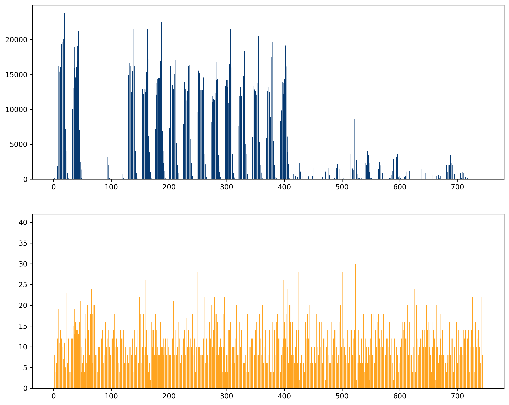
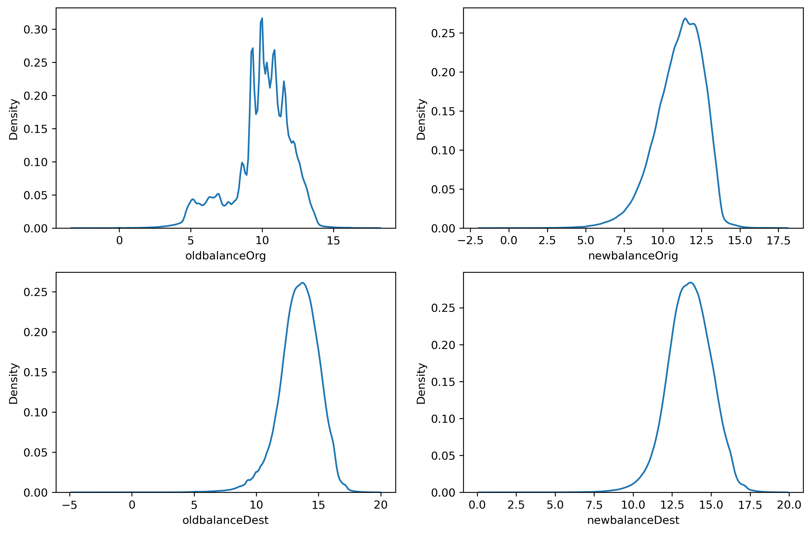

# Phát hiện giao dịch gian lận

# Nguồn dữ liệu:
Dữ liệu gồm 6.35 triệu giao dịch của khách hàng tại ngân hàng. Tên ngân hàng, mã khách hàng, loại tiền tệ đã được ẩn danh.
Các giao dịch đã được đánh dâu là giao dịch gian lận hoặc không.
Các trường dữ liệu gồm:

- step - Khung giờ giao dịch được thực hiện. Thông tin này đã được làm lệch đi so với thời gian thực. Mỗi bước là 1 giờ. Tổng sô bước là 744 (tương ứng 30 ngày).
- type - 5 nhãn: CASH-IN, CASH-OUT, DEBIT, PAYMENT, TRANSFER.
- amount - số tiền giao dịch.
- nameOrig - Mã khách hàng chuyển tiền. Có **6.353.307** mã khách hàng là tài khoản chuyển.
- oldbalanceOrg - số dư tài khoản đi trước giao dịch.
- newbalanceOrig - Số dư tài khoản đi sau giao dịch.
- nameDest - Mã khách hàng nhận tiền. Có **2.722.362** mã khách hàng là tài khoản nhận.
- oldbalanceDest - Số dư tài khoản đến trước giao dịch. Khách hàng không mở tài khoản trong hệ thống kí hiệu M (Merchants) trước mã khách hàng.
- newbalanceDest - Số dư tài khoản đến sau giao dịch. 
- isFraud - Giao dịch được đánh dấu là gian lận. Trong tập dữ liệu này, hành vi gian lận chủ yếu là đối tượng cô gắng thao túng tài khoản của khách hàng, sau đó rút tiền hoặc chuyển khoản đến một tài khoản khác sau đó rút tiền. **Chỉ có 8.213 giao dịch được đánh dấu là gian lận so với 6.35 triệu giao dịch được xem xét**.
- isFlaggedFraud - Đánh dấu giao dịch cố gắng chuyển khoản số lượng lớn trên 200.000 trong 1 lần giao dịch. Chỉ có 16 giao dịch được đánh dấu.

src: https://www.kaggle.com/datasets/vardhansiramdasu/fraudulent-transactions-prediction

# Vấn đề
Từ các dữ liệu được đánh dấu thủ công từ các phản hồi của khách hàng. Mục tiêu là xây dựng công cụ tự động phát hiện các giao dịch có tính chất tương tự với các giao dịch gian lận để có biện pháp phòng ngừa và ngăn chặn trong tương lai.

# Hướng giải quyết

- Do số lượng tương tác lớn (6.35 triệu click) do đó cần sử dụng công cụ khai phá dữ liệu phân tán và song song => lựa chọn Spark
- Dữ liệu dạng bảng => có thể sử dụng SQL trong môi trường Spark => tăng hiệu quả phân tích, giảm thời gian viết code, tận dụng được tốc độ của Spark
- Dự đoán giao dịch có phải gian lận hay không => khai thác đặc trưng dữ liệu theo phiên truy cập, có thể sử dụng các mô hình phân loại nông.
- Do chênh lệch giữa nhãn gian lận và không gian lận có chênh lệch rất lớn (tương ứng 8.213 và 6.354.407) do đó dữ liệu huấn luyện cần được xử lí mất cân bằng.

# Công cụ/ngôn ngữ:
Python, SQL
PySpark
Pandas
Scikit-learn

# Phân tích dữ liệu

* Các giao dịch trả hóa đơn, nộp tiền, debit không có đánh dấu gian lận, thực tế các giao dịch gian lận chủ yếu để rút tiền ra. Do đó các giao dịch có nhãn CASH_IN, PAYMENT, DEBIT sẽ bị loai khỏi dữ liệu huấn luyện. Dữ liệu huấn luyện còn 2.770.409 giao dịch.

|    type|    num|isFraud|fraud_percent|flag|flag_percent|
|--------|-------|-------|-------------|----|------------|
|TRANSFER| 532909|   4097|         0.77|  16|         0.0|
| CASH_IN|1399284|      0|          0.0|   0|         0.0|
|CASH_OUT|2237500|   4116|         0.18|   0|         0.0|
| PAYMENT|2151495|      0|          0.0|   0|         0.0|
|   DEBIT|  41432|      0|          0.0|   0|         0.0|

* Phân tích tần suất giao dịch theo khung giờ cho thấy các giao dịch bình thường có quy luật hoạt động với tần suất cao ở khung giờ ban ngày và tần suất thấp ở khung giờ ban đêm. Các giao dịch gian lận diễn ra liên tục 24h trong ngày.

* Phân phối logagit của các số dư tài khoản có phân phối hình chuông và có xu hướng tập trung vào 1 khoảng hẹp, đồng thời đuôi dài chỉ số ít các giao dịch có số dư lớn.

* Nếu coi các số dư tài khoản ít hơn 100 đơn vị tiền tệ là "hết tiền". Phân bổ số giao dịch gian lận có bảng trạng thái số dư tài khoản như bảng dưới. Có thể thấy phần lớn trường hợp tài khoản đi đều bị rút hết tiền. Tài khoản đến có 3 trạng thái chính:
   - Tài khoản ban đầu không có tiền, sau đó có tiền từ tài khoản bị rút.
   - Tài khoản có tiền và tiếp tục nhận tiền từ các giao dịch chuyển đến.
   - Tài khoản không có tiền và sau khi nhận tiền đến thì nhanh chóng bị rút ra.

|oldbalanceOrg_status|newbalanceOrig_status|oldbalanceDest_status|newbalanceDest_status|total_fraud|
|--------------------|---------------------|---------------------|---------------------|-----------|
|        in_the_money|         in_the_money|         in_the_money|         in_the_money|          2|
|        in_the_money|         in_the_money|         in_the_money|         out_of_money|          0|
|        in_the_money|         in_the_money|         out_of_money|         in_the_money|          0|
|        in_the_money|         in_the_money|         out_of_money|         out_of_money|        158|
|        in_the_money|         out_of_money|         in_the_money|         in_the_money|       2819|
|        in_the_money|         out_of_money|         in_the_money|         out_of_money|         15|
|        in_the_money|         out_of_money|         out_of_money|         in_the_money|       1265|
|        in_the_money|         out_of_money|         out_of_money|         out_of_money|       3911|
|        out_of_money|         out_of_money|         in_the_money|         in_the_money|         25|
|        out_of_money|         out_of_money|         in_the_money|         out_of_money|          0|
|        out_of_money|         out_of_money|         out_of_money|         in_the_money|         10|
|        out_of_money|         out_of_money|         out_of_money|         out_of_money|          8|

# Khai thác đặc trưng dữ liệu (feature engineering):

Các biến gốc từ nguồn dữ liệu được đưa vào mô hình dự báo bao gồm:
* step: khung thời gian xảy ra giao dịch, biến này được chia lấy phần dư cho 24 thành khung 24h mỗi ngày.
* oldbalanceOrg, newbalanceOrig, oldbalanceDest, newbalanceDest: 4 trạng thái tài khoản đi và đến, trước và sau giao dịch.
Các biến được tạo thêm từ các biến số dư tài khoản:
* orig_change = newbalanceOrig - oldbalanceOrg : chênh lệch tài khoản đi trước và sau giao dịch
* dest_change = newbalanceDest - oldbalanceDest : chênh lệch tài khoản đến trước và sau giao dịch
* oldbalance_diff = oldbalanceOrg - oldbalanceDest : chênh lệch tài khoản đi và tài khoản đến trước khi giao dịch
* newbalance_diff = newbalanceOrig - newbalanceDest : chênh lệch tài khoản đi và tài khoản đến sau khi giao dịch
* orig_change_vs_amount = newbalanceOrig - oldbalanceOrg - amount : chênh lệch tài khoản đi trước và sau giao dịch so với số tiền chuyển.
* dest_change_vs_amount = newbalanceDest - oldbalanceDest - amount : chênh lệch tài khoản đến trước và sau giao dịch so với số tiền chuyển.

Các chênh lệch số dư nhằm tăng thêm đặc trưng giúp mô hình có thêm dữ liệu phân lớp. Các chênh lệch số dư này cũng phản ánh đặc trưng của giao dịch.

# Xử lí mất cân bằng nhãn huấn luyện và huấn luyện mô hình:

* Do số lượng giao dịch gian lận chỉ chiếm tỷ lệ nhỏ trong rất nhiều giao dịch, do đó mô hình có thể gặp hiện tượng bias nếu không xử lí mất cân bằng. Phương pháp trong trường hợp này là Undersampling với phương pháp NearMiss. Cụ thể là giữ nguyên các giao dịch có nhãn gian lận, lấy ngẫu nhiên các giao dịch không gian lận với số lượng tương đương số giao dịch gian lận nhưng vẫn đảm bảo phân phối của số giao dịch không gian lận ban đầu.
* Phân chia tập huấn luyện - tập kiểm tra với tỷ lệ 7 - 3. Tỷ lệ này đảm bảo mô hình học được nhiều đặc trưng và giảm overfit tốt nhất.
* Sử dụng mô hình XGBoostClassifier với các tham số sau: learning_rate = 0.01, max_depth=18, reg_lambda=3.8, n_estimators=500

# Kết quả huấn luyện tính trên toàn bộ dữ liệu huấn luyện:
* Đoán đúng giao dịch gian lận / tổng số giao dịch gian lận thật sự: 91.45%
* Đoán đúng giao dịch gian lận & giao dịch không gian lận / tổng số phiên: 98.74%

| |Không gian lận| Gian lận|
|---|---|---|
|Dự đoán không gian lận|2728114|702|
|Dự đoán gian lận|34082|7511|

Kết quả dự đoán phát hiện đúng 7.511 trường hợp gian lận thật sự, có 34082 giao dịch không gian lận nhưng sẽ bị ngân hàng xác minh, bỏ sót 702 trường hợp gian lận.

Phân tích ma trận chi phí cho kết quả như sau:
* Các giao dịch gian lận và không gian lận dự đoán đúng chiếm phần lớn giá trị giao dịch.
* Tổng giá trị giao dịch gian lận bị phát hiện là 11.9 tỷ; giá trị trung bình các giao dịch gian lận bị phát hiện lên đến 1.59 triệu => các giao dịch gian lận giá trị lớn đã bị phát hiện.
* Tổng giá trị giao dịch gian lận không bị phát hiện là 97 triệu; giá trị trung bình các giao dịch gian lận không bị phát hiện chỉ ở mức 138 nghìn => các giao dịch gian lận không phát hiện được là các giao dịch nhỏ.

|status                    |count  |total_amount|amount_per_transaction|
|--------------------------|-------|------------|----------------------|
|Not Fraud - True predict  |2728114|861708.59   |315862.38             |
|True Fraud - True predict |7511   |11959.46    |1592259.49            |
|Not Fraud - False predict |34082  |5939.98     |174284.86             |
|True Fraud - False predict|702    |96.95       |138111.63             |

**Kết luận: mô hình đã phát hiện phần lớn các giao dịch gian lận có giá trị cao, có thể phục vụ hỗ trợ phòng chống và phát hiện kịp thời các giao dịch gian lận, nâng cao hiệu quả hoạt động quản lí rủi ro.**
